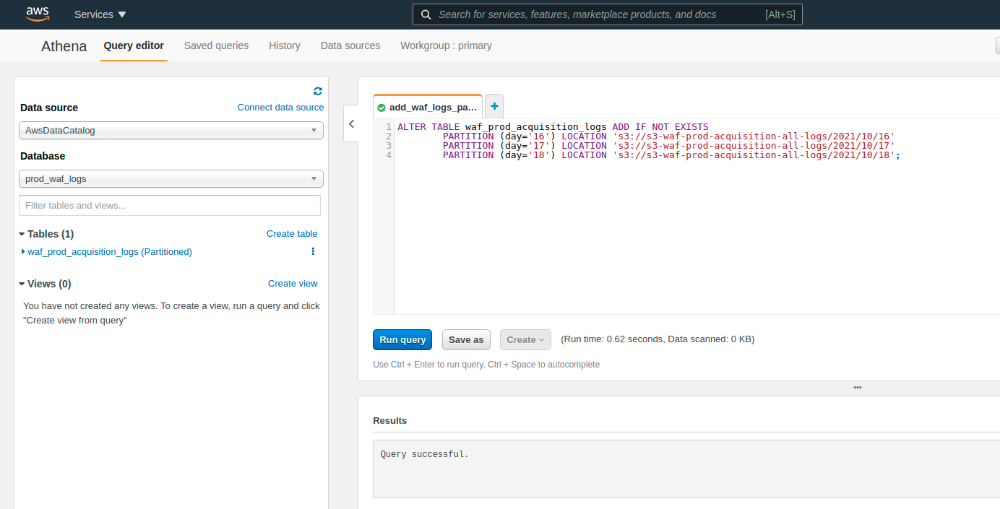

<p align="center">
  <a href="https://dev.to/vumdao">
    
  </a>
</p>
<h1 align="center">
  <div><b>AWS Athena Query WAF logs</b></div>
</h1>

## Abstract
- [Querying AWS WAF Logs](https://docs.aws.amazon.com/athena/latest/ug/waf-logs.html) - AWS WAF logs include information about the traffic that is analyzed by your web ACL, such as the time that AWS WAF received the request from your AWS resource, detailed information about the request, and the action for the rule that each request matched.

- In AWS WAF, the following three actions for rules applied to a Web ACL.
   - **ALLOW**：Allows the request if it matches the rule.
   - **BLOCK**：Blocks the request if it matches the rule.
   - **COUNT**：Instead of allowing or blocking a request, it detects the request as a count if it matches the rule. And if there are multiple rules in the Web ACL, it will move on to match against the other rules. Finally, if it has not been detected by any other rules, set default action will be executed.

  - Count mode is an action that detects but does not actually allow or block the request. It is generally used for rule verification. We can use Athena to query AWS WAF logs for statistic of POST requests to a specific API

- This post introduces how to use Pulumi to create Athena database on the `primary` workgroup with logs table and partitions to query, compare with [Partition Projection](https://docs.aws.amazon.com/athena/latest/ug/partition-projection.html)

<p align="center">

</p>

## Table Of Contents
 * [To create the AWS WAF table](#To-create-the-AWS-WAF-table)
 * [Load partitions](#Load-partitions)
 * [Example Queries for AWS WAF Logs](#Example-Queries-for-AWS-WAF-Logs)
 * [Using Pulumi to up the resources](#Using-Pulumi-to-up-the-resources)
 * [Partition Projection with Amazon Athena](#Partition-Projection-with-Amazon-Athena)

---

## 🚀 **To create the AWS WAF table** <a name="To-create-the-AWS-WAF-table"></a>
- AWS WAF logs have a known structure whose partition scheme you can specify in advance and reduce query runtime. The format of WAF logs is YY/MM/dd/HH.

- Here we just want to query logs in October so partitioned by `day` and object is `2021/10/`
```
import * as pulumi from "@pulumi/pulumi";
import * as aws from "@pulumi/aws";

const table_name = 'waf_prod_acquisition_logs';
const bucket_log = 's3-waf-prod-acquisition-all-logs'

function createTableQuery() {
    return `CREATE EXTERNAL TABLE IF NOT EXISTS ${table_name} (
        httpRequest array<
            struct<clientIp: string,
                   uri: string,
                   httpMethod: string>>
    )
    PARTITIONED BY (
      day string
    )
    ROW FORMAT SERDE 'org.openx.data.jsonserde.JsonSerDe'
    LOCATION 's3://${bucket_log}/2021/10/';`;
}
```

## 🚀 **Load partitions** <a name="Load-partitions"></a>
- Load partitions by `ALTER TABLE ADD PARTITION` and here we restrict day 16, 17 and 18 only

```
function addPartitonQuery() {
    return `ALTER TABLE ${table_name} ADD IF NOT EXISTS
        PARTITION (day='16') LOCATION 's3://${bucket_log}/2021/10/16'
        PARTITION (day='17') LOCATION 's3://${bucket_log}/2021/10/17'
        PARTITION (day='18') LOCATION 's3://${bucket_log}/2021/10/18';`;
}
```

## 🚀 **Example Queries for AWS WAF Logs** <a name="Example-Queries-for-AWS-WAF-Logs"></a>
- The query filter `httprequest` with method `POST`, uri `/api/2/register` and then group `clientip` with count number >= 10

```
const topUserQuery =
    `with t1 as (
        SELECT
            httprequest[1].clientip clientip,
            httprequest[1].uri uri,
            httprequest[1].httpmethod httpmethod
        FROM "sampledb"."waf_prod_acquisition_logs"
        WHERE
            httprequest[1].uri='/api/2/register' AND
            httprequest[1].httpmethod='POST'
        )

        SELECT
            t1.clientip, count(*) as cnt
        FROM t1 group by t1.clientip
        having count(*) >= 10
        order by cnt DESC`;
```

## 🚀 **Using Pulumi to up the resources** <a name="Using-Pulumi-to-up-the-resources"></a>
- Source code

    <details>
    <summary>index.ts</summary>

    ```
    import * as pulumi from "@pulumi/pulumi";
    import * as aws from "@pulumi/aws";


    const table_name = 'waf_prod_acquisition_logs';
    const bucket_log = 's3-waf-prod-acquisition-all-logs'

    const topUserQuery =
        `with t1 as (
            SELECT
                httprequest[1].clientip clientip,
                httprequest[1].uri uri,
                httprequest[1].httpmethod httpmethod
            FROM ${table_name}
            WHERE
                httprequest[1].uri='/api/2/register' AND
                httprequest[1].httpmethod='POST'
            )

            SELECT
                t1.clientip, count(*) as cnt
            FROM t1 group by t1.clientip
            having count(*) >= 10
            order by cnt DESC`;

    function createTableQuery() {
        return `CREATE EXTERNAL TABLE IF NOT EXISTS ${table_name} (
            httpRequest array<
                struct<clientIp: string,
                    uri: string,
                    httpMethod: string>>
        )
        PARTITIONED BY (
        day string
        )
        ROW FORMAT SERDE 'org.openx.data.jsonserde.JsonSerDe'
        LOCATION 's3://${bucket_log}/2021/10/';`;
    }

    function addPartitonQuery() {
        return `ALTER TABLE ${table_name} ADD IF NOT EXISTS
            PARTITION (day='16') LOCATION 's3://${bucket_log}/2021/10/16'
            PARTITION (day='17') LOCATION 's3://${bucket_log}/2021/10/17'
            PARTITION (day='18') LOCATION 's3://${bucket_log}/2021/10/18';`;
    }

    function getQueryUri(queryId: string) {
        const config = new pulumi.Config("aws");
        const region = config.require("region");
        return `https://${region}.console.aws.amazon.com/athena/home?force#query/saved/${queryId}`;
    }

    const athena_waf_db = new aws.athena.Database('prod_waf_logs', {
        bucket: 'aws-athena-query-results-123456789012-us-east-1',
        forceDestroy: true,
        name: 'prod_waf_logs'
    });

    const createTableAthenaQuery = new aws.athena.NamedQuery('create_waf_logs_table',
        { database: athena_waf_db.id, query: createTableQuery(), description: 'Create WAF logs table'});

    const addPartitionAthenaQuery = new aws.athena.NamedQuery('add_waf_logs_partitions',
        { database: athena_waf_db.id, query: addPartitonQuery(), description: 'Add partitions to WAF logs table base on year, month, day'});

    const topUserAthenaQuery = new aws.athena.NamedQuery('topUser',
        { database: athena_waf_db.id, query: topUserQuery, description: 'Run query to get data'});

    exports.createTableAthenaQueryUri = createTableAthenaQuery.id.apply(getQueryUri);
    exports.addPartitionAthenaQueryUri = addPartitionAthenaQuery.id.apply(getQueryUri);
    exports.topUserQueryUri = topUserAthenaQuery.id.apply(getQueryUri);
    ```

    </details>

- Pulumi up and then check output


- Pulumi stack graph


- Click on the output link of saved queries to run on AWS Athena





## 🚀 **Partition Projection with Amazon Athena** <a name="Partition-Projection-with-Amazon-Athena"></a>
- You can use [partition projection](https://docs.aws.amazon.com/athena/latest/ug/partition-projection.html) in Athena to speed up query processing of highly partitioned tables and automate partition management.
- In partition projection, partition values and locations are calculated from configuration rather than read from a repository like the AWS Glue Data Catalog. Because in-memory operations are often faster than remote operations, partition projection can reduce the runtime of queries against highly partitioned tables.
- Partition projection automatically adds new partitions as new data is added. This removes the need for you to manually add partitions by using `ALTER TABLE ADD PARTITION`.
- **Important**: Enabling partition projection on a table causes Athena to ignore any partition metadata registered to the table in the AWS Glue Data Catalog or Hive metastore

- Now we create Athena table with partition projection and run the query to compare with previous result.
- Pulumi stack with projection

    <details>
    <summary>index.ts</summary>

    ```
    import * as pulumi from "@pulumi/pulumi";
    import * as aws from "@pulumi/aws";


    const table_name = 'waf_prod_acquisition_logs';
    const bucket_log = 's3-waf-prod-acquisition-all-logs'

    const topUserQuery =
        `with t1 as (
            SELECT
                httprequest[1].clientip clientip,
                httprequest[1].uri uri,
                httprequest[1].httpmethod httpmethod
            FROM ${table_name}
            WHERE
                httprequest[1].uri='/api/2/register' AND
                httprequest[1].httpmethod='POST' AND
                datehour >= '2021/10/16' AND datehour < '2021/10/19'
            )

            SELECT
                t1.clientip, count(*) as cnt
            FROM t1 group by t1.clientip
            having count(*) >= 10
            order by cnt DESC`;

    function createTableQuery() {
        return `CREATE EXTERNAL TABLE IF NOT EXISTS ${table_name} (
            httpRequest array<
                struct<clientIp: string,
                    uri: string,
                    httpMethod: string>>
        )
        PARTITIONED BY (
            datehour STRING
        )
        ROW FORMAT SERDE 'org.openx.data.jsonserde.JsonSerDe'
        STORED AS INPUTFORMAT 'org.apache.hadoop.mapred.TextInputFormat'
        OUTPUTFORMAT 'org.apache.hadoop.hive.ql.io.HiveIgnoreKeyTextOutputFormat'
        LOCATION 's3://${bucket_log}/'
        TBLPROPERTIES
        (
        "projection.enabled" = "true",
        "projection.datehour.type" = "date",
        "projection.datehour.range" = "2021/10/16/00,NOW",
        "projection.datehour.format" = "yyyy/MM/dd/HH",
        "projection.datehour.interval" = "1",
        "projection.datehour.interval.unit" = "HOURS",
        "storage.location.template" = "s3://${bucket_log}/\${datehour}"
        );`;
    }

    function getQueryUri(queryId: string) {
        const config = new pulumi.Config("aws");
        const region = config.require("region");
        return `https://${region}.console.aws.amazon.com/athena/home?force#query/saved/${queryId}`;
    }

    const athena_waf_db = new aws.athena.Database('prod_waf_logs', {
        bucket: 'aws-athena-query-results-123456789012-us-east-1',
        forceDestroy: true,
        name: 'prod_waf_logs'
    });

    const createTableAthenaQuery = new aws.athena.NamedQuery('create_waf_logs_table',
        { database: athena_waf_db.id, query: createTableQuery(), description: 'Create WAF logs table'});

    const topUserAthenaQuery = new aws.athena.NamedQuery('topUser',
        { database: athena_waf_db.id, query: topUserQuery, description: 'Run query to get data'});

    exports.createTableAthenaQueryUri = createTableAthenaQuery.id.apply(getQueryUri);
    exports.topUserQueryUri = topUserAthenaQuery.id.apply(getQueryUri);
    ```

    </details>

- Pulumi stack graph


- Create table


- Run query


- Although small partition but we see it is faster than manual loading partitions.

---

<h3 align="center">
  <a href="https://dev.to/vumdao">:stars: Blog</a>
  <span> · </span>
  <a href="https://github.com/vumdao/aws-athena-waf">Github</a>
  <span> · </span>
  <a href="https://stackoverflow.com/users/11430272/vumdao">stackoverflow</a>
  <span> · </span>
  <a href="https://www.linkedin.com/in/vu-dao-9280ab43/">Linkedin</a>
  <span> · </span>
  <a href="https://www.linkedin.com/groups/12488649/">Group</a>
  <span> · </span>
  <a href="https://www.facebook.com/acquisition-104917804863956">Page</a>
  <span> · </span>
  <a href="https://twitter.com/VuDao81124667">Twitter :stars:</a>
</h3>